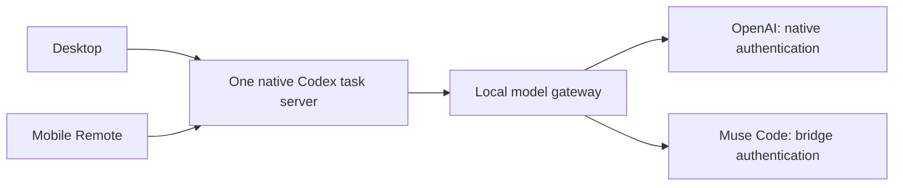

# ChatGPT + Muse: two shortcuts, one native task server

The experimental shared gateway is implemented and tested with ChatGPT's `codex-cli 0.154.0-alpha.6.2`. It replaces the earlier additive architecture for this launch mode. The old additive launcher remains local-only.

## Install and use

From a checkout with Node.js 22+ and Muse Code already installed and signed in:

```sh
npm run build
node scripts/install-shared-macos.mjs --dock
```

This installs `~/Applications/ChatGPT + Muse.app` and adds it alongside the original ChatGPT icon in the Dock. Omit `--dock` to install only the companion app. Fully quit ChatGPT with Cmd+Q before switching shortcuts. Starting another shortcut while ChatGPT is running cannot change that process's environment.

- **ChatGPT** starts the installed app normally, with its native OpenAI connection.
- **ChatGPT + Muse** starts that same installed app with both model groups available through a local inference gateway. No Terminal window is needed.

The launcher creates a temporary CLI shim and passes `openai_base_url` only to its native server process. It does not edit the installed app, shell profiles, login services, saved provider settings, account credentials, task databases, or Remote enrollment. Its versioned payload lives in `~/.local/share/muse-bridge/shared-launcher/`. Desktop picker defaults are stored separately in `~/.local/share/muse-bridge/shared/model-preferences.json`.

The Muse shortcut checks the native executable version on each launch. After an app update, it refuses to activate until compatibility has been tested and the shortcut reinstalled. The original icon continues to work independently. To remove the integration, quit ChatGPT, remove the companion app and its Dock tile, and delete the bridge's `shared-launcher` and `shared` directories if no longer needed. The normal app needs no restoration script.

## How requests flow



Codex owns tasks, writer locks, history, tools, approvals and Remote. The gateway routes inference by the selected model ID; it does not create a worker per task or provider. A short-lived native discovery process has Remote disabled and exits before the real task server starts. The real server retains native Remote behavior.

The gateway proxies native `/models` discovery, preserving every OpenAI metadata field and appending `muse/<id>` entries. OpenAI discovery remains live; Muse discovery refreshes every five minutes. Native model cache and picker refresh behavior still apply. A regular launch can briefly show cached Muse entries until its native catalog refresh completes. A stock launch does not retain the gateway URL.

OpenAI HTTP and WebSocket inference uses the original native authentication and upstream endpoint. The loopback gateway sees those requests in memory, adding a local dependency and another possible failure point. It forwards upstream errors, including a WebSocket authentication failure before accepting the native connection. It does not redirect credentials to another host or send OpenAI credentials to Muse. If the gateway fails, both model groups in that launch can fail. Fully quit and use the original icon to bypass it.

Muse requests use the configured bridge account or explicit key-file selection. Muse's own tools are disabled; validated tool decisions return to Codex for execution and approval. Provider switches preserve full input history, including bounded in-memory expansion for incremental Responses requests. Missing history, unsupported inputs, and unavailable Muse models produce explicit errors, never an automatic provider switch.

## Limits and Remote verification

- Live OpenAI → Muse → OpenAI turns passed on one ephemeral native task, using the existing ChatGPT and Muse account logins. A separate native fixture test verified a Muse → native shell tool → Muse round trip, one server PID, a direct native client seeing the same catalog/task, private desktop defaults, and standard-launch recovery.
- **The actual mobile UI still needs device verification after launching the companion app.** The shared architecture removes the earlier competing Remote processes, but it does not prove that every mobile build displays custom model IDs. No mobile application is patched.
- Desktop and mobile still obey native device ownership. This integration does not forcibly take a task away from another active device.
- Remote requests go directly to the native server. Remote settings writes therefore retain native persistence; the private desktop preference interceptor does not cover them. If a phone saves Muse as the global default, select an OpenAI default when using the stock app. Tasks saved with a Muse model likewise need an OpenAI selection to continue through the stock launcher. History is retained.
- Muse supports text and Codex-executed tools. Images, audio, file inputs, native compaction and Responses Lite are unsupported. The optional OpenAI-hosted web search definition is omitted from Muse's tool choices; an explicitly required hosted search or other unsupported hosted tool fails. These restrictions do not alter OpenAI requests.
- WebSocket setup authenticates the native OpenAI connection before accepting the local connection, even for Muse. An OpenAI authentication failure or outage can therefore prevent Muse WebSocket startup. Muse generation itself still uses only the Muse login.
- The launcher does not add Muse to ordinary ChatGPT web/cloud conversations. The desktop host must be running and reachable for native Remote use.

## Verification commands

```sh
npm run check
MUSE_SHARED_NATIVE_TEST=1 node --test test/shared-native.test.mjs
```

The automated native test uses a temporary Codex home, synthetic account data and local fixture providers. It makes no paid model request or changes to the user's config. Gateway tests cover catalog metadata, compressed HTTP/SSE, WebSockets, free connection warmup, cancellation, credential separation, upstream 401 propagation, provider switching, unknown models, and history bounds. macOS launcher tests verify process-only environment changes, cleanup, version refusal and LaunchServices compatibility.

The private live smoke script used during development lives under ignored `artifacts/`; it makes real generation requests and is not part of the default suite.

References: [built-in OpenAI base URL configuration](https://learn.chatgpt.com/docs/config-file/config-advanced#custom-model-providers), [app-server protocol](https://learn.chatgpt.com/docs/app-server).
